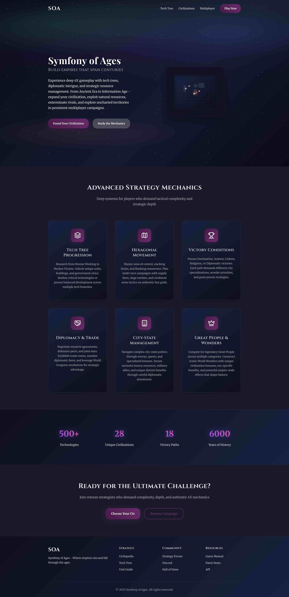

# Symfony of ages

**Symfony of Ages** is a turn-based browser game inspired by *Civilization*. Players expand their influence, explore a hex-based map, and engage in strategic gameplay to dominate the neighborhood.

This is an experimental setup for learning, so expect the code to change frequently. But if you're also exploring Ecotone or curious how event sourcing might work in a Symfony project, feel free to check it out, leave feedback, or just follow along.Add commentMore actions

## Project Goals

- Turn-based gameplay on a hexagonal map
- 2D visual style inspired by *Civilization*
- Playable directly in the browser

## Tech Stack

- **Symfony 7.3**, **Api platform**, **Ecotone** – Backend framework (API & game logic)
- **Vite**, **Symfony UX (Live Components, Turbo)** – Interactive frontend behavior without heavy JavaScript SPA
- **PixiJS** – Fast WebGL rendering of the game map and units
- **TypeScript** – Strongly-typed logic for frontend interactions
- **HTML5/CSS3** – Core UI structure

## Features (WIP)

- Dynamic hex map rendering
- Terrain types with different strategic values (plains, forest, mountain, swamp, water, desert)
- Turn-based movement and interaction system
- Fog of war
- Event-driven gameplay

## Setup & Development

1. If not already done, [install Docker Compose](https://docs.docker.com/compose/install/) (v2.10+)
2. Run `docker compose build --pull --no-cache` to build fresh images
3. Run `docker compose up --wait` to set up and start a fresh Symfony project
4. Run `npm run build` or `npm run dev`
5. Open `https://localhost` in your favorite web browser and [accept the auto-generated TLS certificate](https://stackoverflow.com/a/15076602/1352334)
6. Open `https://localhost/api` (API documentation)
7. Run `docker compose down --remove-orphans` to stop the Docker containers.

